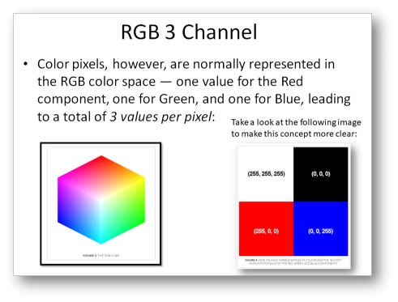
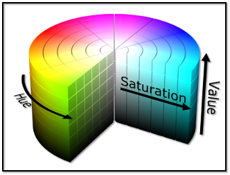
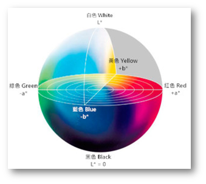
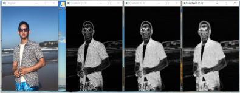
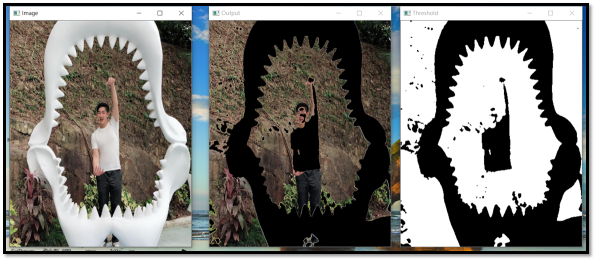

# Computer-Vision

The PyimageSearch-Optimized Project & AIA Academy CV related project

## CV Basic Theory and Implement

### A.Basic-Theory : 

-  What is RGB ?  
  
-  HSV & LAB Color Space  
  
  

### B.Apply Myself in RealCase :

- Gradient in Real Image 
  
- OTSU Thresholding Effect 
  
