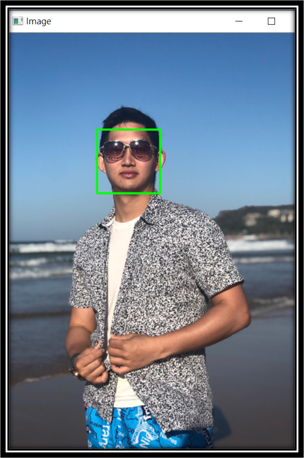
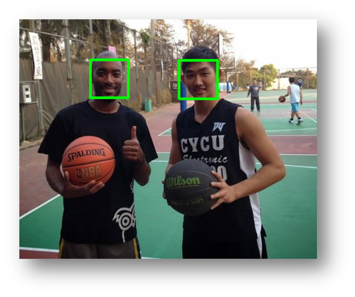
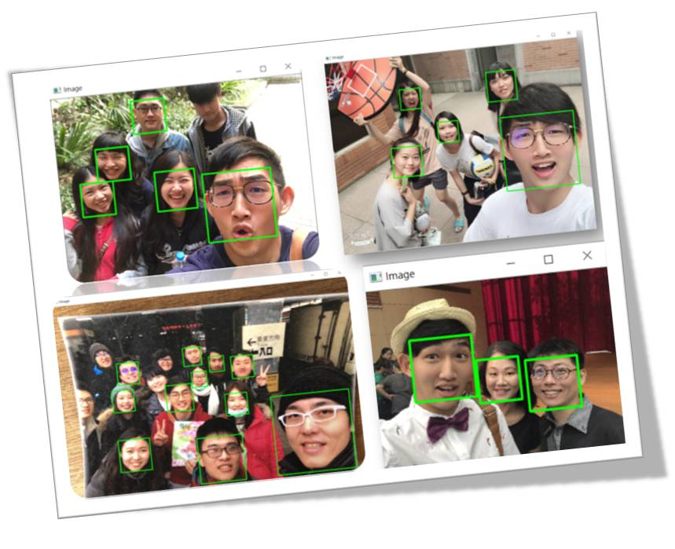
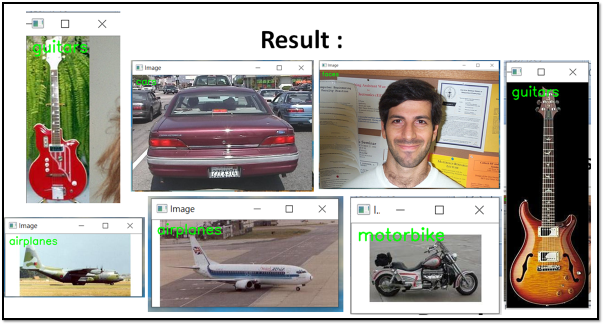

# Computer-Vision

The PyimageSearch-Optimized Project & AIA Academy CV related project

# Theorem & CV tool : 
- 1.opencv  
    # Classifier 
        - cv2.CascadeClassifier : Multiple classifier 
        - cv2.haarcascade : haar feature classifier（特徵分類器), including multiple face object detect
       [reference With multiple face object detect classifier](https://blog.csdn.net/itismelzp/article/details/50379359)
    - cv2.detectMultiScale.detectMultiScale : Faces detect function
    - cv2.warpAffine : image shifting function(平移影像)
    - cv2.getRotationMatrix2D() 旋轉影像 
    - cv2.getAffineTransform() 圖像仿射變換 
    - cv2.warpPerspective() + getPerspectiveTransform() 影像透視 

    #### morphological image processing operations such as erosion, dilation, opening, and closing形態學處理（腐蝕膨脹，開閉運算，禮帽黑帽，邊緣檢測）
    [Morphological reference](https://iter01.com/542756.html) 
    - 1.定義結構元素
    - 2.腐蝕和膨脹 : 
        - 膨脹（Dilation）和腐蝕（Erosion）
    - 3.開運算和閉運算
        - 開運算 : 先腐蝕後膨脹，用於移除由影像噪聲形成的斑點
        - 閉運算 : 先膨脹後腐蝕，用來連線被誤分為許多小塊的物件
        - 開運算總結：
        （1）開運算能夠除去孤立的小點，毛刺和小橋，而總的位置和形狀不變。
        （2）開運算是一個基於幾何運算的filter(你會看到有人翻成濾波器或是濾片)
        （3）結構元素大小的不同將導致濾波效果的不同
        （4）不同的結構元素的選擇導致了不同的分割，即提取出不同的特徵

        - :star:閉運算總結：
        （1）閉運算能夠填平小湖（即小孔），彌合小裂縫，而總的位置和形狀不變。
        （2）閉運算是通過填充圖像的凹角來濾波圖像的。
        （3）結構元素大小的不同將導致濾波效果的不同。
        （4）不同結構元素的選擇導致了不同的分割。
    - 4.禮帽運算/ 黑帽運算
        - MORPH_TOPHAT : It can be used to enhance the contrast of bright features in an image
            - 禮帽運算是用原始影像減去開運算影像操作 禮帽運算能夠取得影像的雜訊資訊，或獲得比原始影像的邊緣更亮的邊緣資訊
        - MORPH_BLACKHAT : It can be used to enhance the contrast of dark features in an image
            - 黑帽運算是用原始影像減去閉運算影像操作。黑帽運算能夠取得影像內部的小孔，或前景色中的小黑點，或獲得比原始影像的邊緣更暗的邊緣資訊
        (!) 該演算法可以用於影像識別的預處理，用於影像二值化後取出孤立點
    - 5.1 形態學梯度運算
        - 梯度 = 膨脹 - 腐蝕 = 明顯的邊緣(AOI)
        - 形態學梯度運算是用影像的膨脹影像減腐蝕影像的操作，該操作可以取得原始影像中前景影像的邊緣 
    - 6.1 檢測邊緣 : 
        - 形態學檢測邊緣的原理很簡單，在膨脹時，影像中的物體會向周圍“擴張”；腐蝕時，影像的額物體會“收縮”。

    - 6.2 檢測角點（拐角）: 
        - 所不同的是先用十字形的結構元素膨脹畫素，這種情況下只會在邊緣處“擴張”，角點不發生變化。接著用菱形的結構元素腐蝕原影像，導致只有在拐角處才會“收縮”，而直線邊緣都未發生變化。
　　    第二步是用X行膨脹原影像，焦點膨脹的比邊要多。這樣第二次用方塊腐蝕時，角點恢復原狀，而邊要腐蝕的更多。所以當兩幅影像相減時，只保留了拐角處

 
- 2.imutils.translate :  a series of convenience functions to make basic image processing functions such as translation, rotation, resizing, skeletonization, and displaying images easier with OpenCV
- 3.

# Apply : 
## 1.Automatic Face-Detection : 

### Facial Detection : 

- In Single-Person

- In Multi-Person

## 2.Image-Classfication : 

- Test image-classification in 5-Object :

    - A.Face 
    - B.Guitar
    - C.Car
    - D.Motorbike
    - E.Airplane

## 3.Automatic License-Plate Recognition  :

- Test on my Car :

