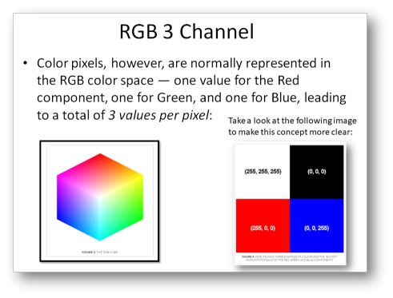
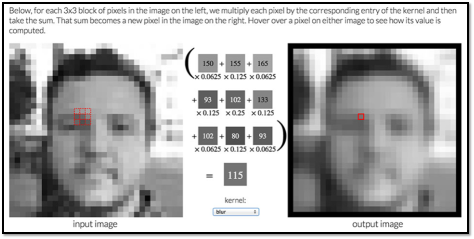
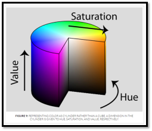
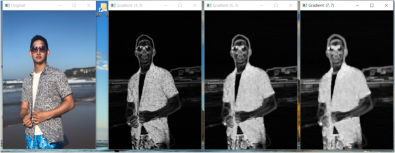

# Computer-Vision

The PyimageSearch-Optimized Project & AIA Academy CV related project

## CV Basic Theory and Apply

### A.Basic-Theory : 

-  What is RGB ?  

- Briefly express CNN(Convolution Neural Network)

- Talk about HUE

### B.Apply in RealCase :

- Gradient in Real Image

- OTSU Thresholding Effect

