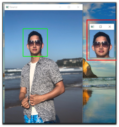
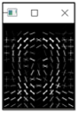
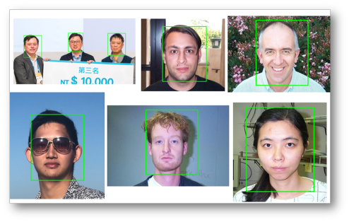

# Computer-Vision Module 2

### Chp2.1 : Object Detection Template - Pre-define Object detect Boundary 
    
### Chp2.2 : Create Specific-Detector and Testing detector for prediction 
        - A. Train the Detector : 
            - Input : Training Image/ Annotation(How to generate yourself?)
            - Output : The trained-detector(.svm) 
            
        - B. Prediction : 
            - Input : Testing Image/ (.svm)File
            - Output : Object detection for input(object)
            
### Chp2.3 : Pyramid for Image & Sliding window 
        - A. Zoom in image from OriginSize to Tiny  
        
        - B. Slide window :  
            - Argument : 
                - Image : Input image path
                - Height : Sliding window height size
                - Width : Sliding window width size
                - Scale : Zoom in scale (after every complete window)
                - StepSize : Sliding window's step 
     
### Chp2.4 :  The method that teach us how to optimize our Object-detection detector(Model) 
    
### Chp2.5 : Explore Width_Height_Scale 
        - A. Input : Argument & json  
            - Argument : Set the path of (.json) File
            - json : Set the path of grabbing "annotation"(image_annotation)  
        - B. Output :  (ex : cars.json)  
                [INFO] avg. width:  184.46 
                [INFO] avg. height: 62.01
                [INFO] aspect ratio: 2.97
                
  

  

  
