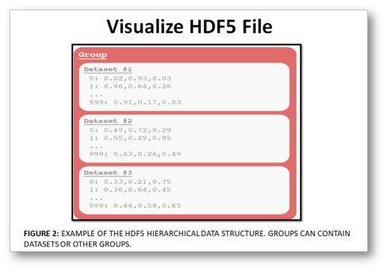
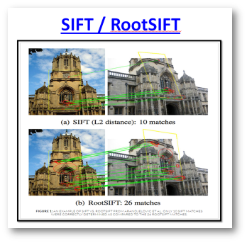

# Computer-Vision Module 3

### Chp3 Extracting keypoints and local invariant descriptors : 
            - Input : Image, argument : The path to the folder of image
            - Output : The "Extracting keypoints and "invariant descriptors" (.hdf5) file
            
            
  

  