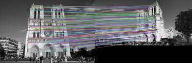
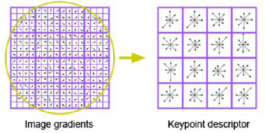
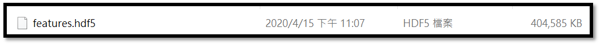
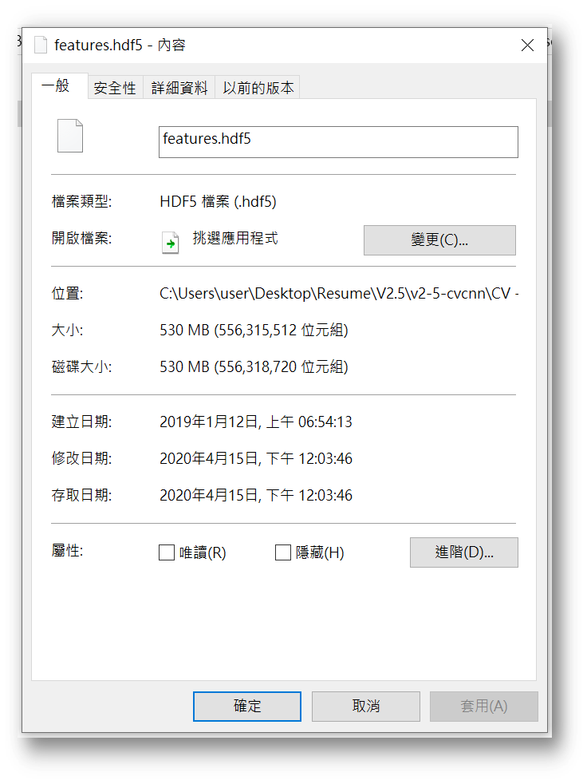

# Computer-Vision Module 3 - Extracting keypoints and local invariant descriptors

### Save the Extracted information into HDF5 format :  

- SIFT  
  

- SIFTEXTRACT  
  

- Input : Image, argument : The path to the folder of image
- Output : The "Extracting keypoints and "invariant descriptors" (.hdf5) file

  
  
