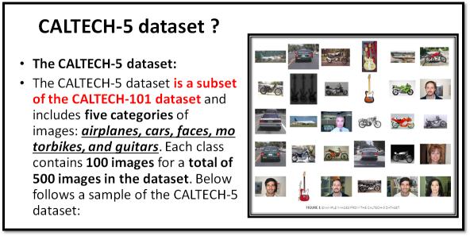
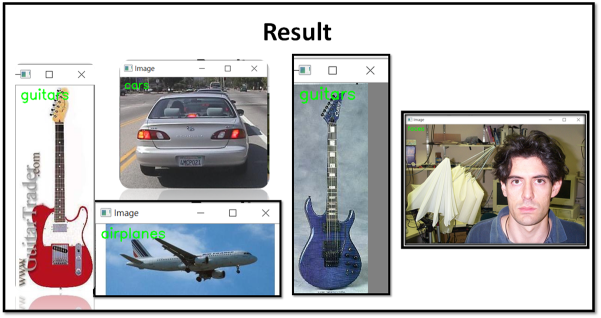

# Computer-Vision Module 4

  

###    A. Chp 4.6 - A.Bag of visual words for classification : 
    
         1.index_features.py : Generate the "feature-extracted data file" (.hdf5) by using image dataset 
        
         2.cluster_features.py : Generate the BOVW by clustering the data(clustering/Clustering percent is an changeable parameter) 
        
         3.extract_pbow.py : Generate the BOVW by clustering the data(clustering/Clustering percent is an changeable parameter) 
        
         4.train_model.py : Generate(create) the bag-of-visual-words representation(BOVW)File
        
         5.test_model.py : Test the image classification for 5 different class
   
  

###  B. Chp 4.7 - A different type of image pyramid : 
    
         1.Sample_datasets.py : "Grab the data" and "generate an image dataset" for us to use.
            - Input : The Training Dataset's(by Class inthis case) image need to be exist 
            
         2.index_features.py : Generate the "feature-extracted data file" (.hdf5) by using image dataset 
            - Input : Input the Training Dataset's image
            - Output : receive (training_features.hdf5) File - the managed image-dataset(.hdf5)
            
         3.cluster_features.py : Generate the BOVW by clustering the data(clustering/Clustering percent is an changeable parameter) 
            - Input : training_features(.hdf5) 
            - Output : Cluster data(vocab.cpickle) File
            
         4.extract_pbow.py : Generate(create) the pyramid of bag-of-visual-words representation(PBOW)File
            - Input : feature-extracted data file(training_features.hdf5)/ Clustering data(vocab.cpickle) file
            - Output : (training_pbow.hdf5)File
            
         5.train_model.py : Train and Save the Model
            - Input : Training Dataset's image/ After-managed Training Dataset(.hdf5)File/ PBOW-Clustering Data(ex : training_features.hdf5)
            - Output : Classifier(model.cpickle) File, The model we trained and will be apply in the upcoming Test.py
            
         6.test_model.py : Test the image classification for 5 different class
            - Input : Testing Dataset's image(Parameter)/ Clustering data(vocab.cpickle) file/ classifier(ex : model_L4.cpickle) /PBOW-Clustering Data(training_features.hdf5)/ level of pyramid (should be the same with "Level Pyramid Trained-model(Control by extracted_pbow.py file)")
            - Output : The "result" of "random image classification"
            
  
   
