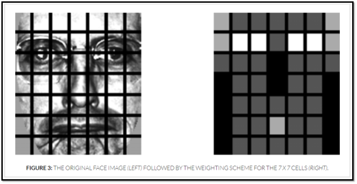
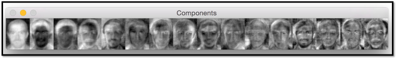
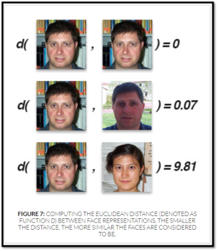
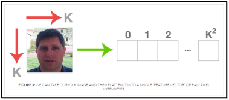
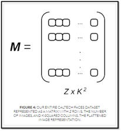
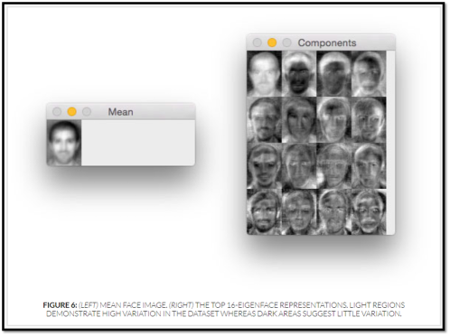

# Computer-Vision Module 5

   ### CHP 5.1 - Face Recognition Introduction
   
  
   
   ### CHP 5.2 - LBP Algorithm : 
       - More Robust then Eigenface Algorithm

  

   #### <LBS_component> 
  

   ### CHP 5.3 - Eigenface Algorithm : 
       - perform better in "caltech faces" in LBP Algorithm
       - From there, we flatten each image into a vector and store them in a matrix(Image_Data.mat)
       
   #### <Face_Euclidean_Distance> 
  

   #### <Image_Flatten> 
  

   #### <Image_Matrix> 
  

   #### <Mean_Face_Image> 
  

   ### CHP 5.4 - Create your own face data : 
       - Generate the face data(ex : david.txt) ourself
       - Input : cascades.xml / Computer Camera
       - Output : Your Face data(.txt File)

  
  
   
   ### CHP 5.5 - Complete Face Recognition pipeline :  There's 3 Main Code in chp5_5
       - 1.gather_selfies.py : Grab your face information in this program 
           - Output : The file of your face information -> (your name.txt)file
           
       - 2.train_recognizer.py : 
           - Output : The classifier model -> (classifier.model)file

       - 3.recognize.py :  Start to recognize the(your) face
           - Output : From the camera we can saw the object detection in your face including recognize your name on it.
   
  #### < Prediction >         
  
