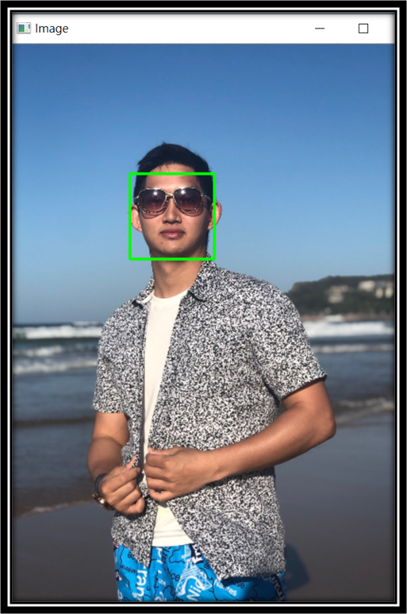
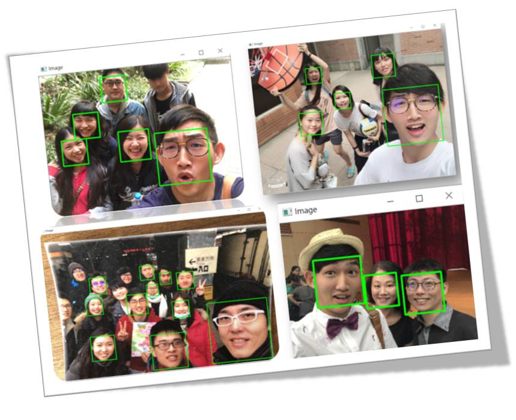
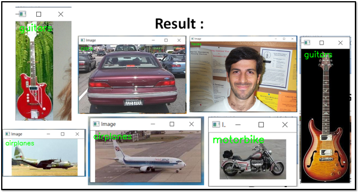
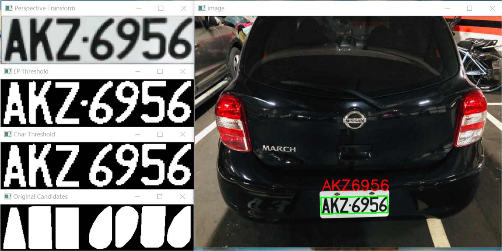

# Computer-Vision

The PyimageSearch-Optimized Project & AIA Academy CV related project

## 1.Automatic Face-Detection : 

### Facial Detection : 

- In Single-Person

- In Multi-Person

## 2.Image-Classfication : 

- Test image-classification in 5-Object :

    - A.Face 
    - B.Guitar
    - C.Car
    - D.Motorbike
    - E.Airplane

## 3.Automatic License-Plate Recognition  :

- Test on my Car :

