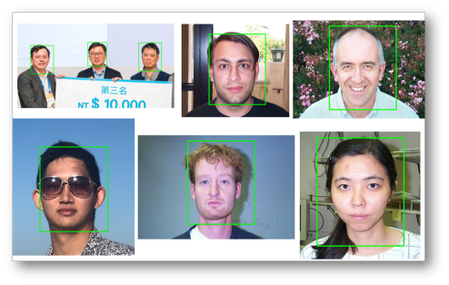

# Computer-Vision

The PyimageSearch-Optimized Project & AIA Academy CV related project

##  1.Automatic Object-Detection : 

## 2.Face-Detection : 

- Facila Detection in Multi-Person

## 3.Image-Classfication : 

- 5 Different Object classification 

    - A.Face 
    - B.Guitar
    - C.Car
    - D.Motorbike
    - E.Airplane

## 4.Automatic License-Plate Recognition  :

- Test on my Car 

