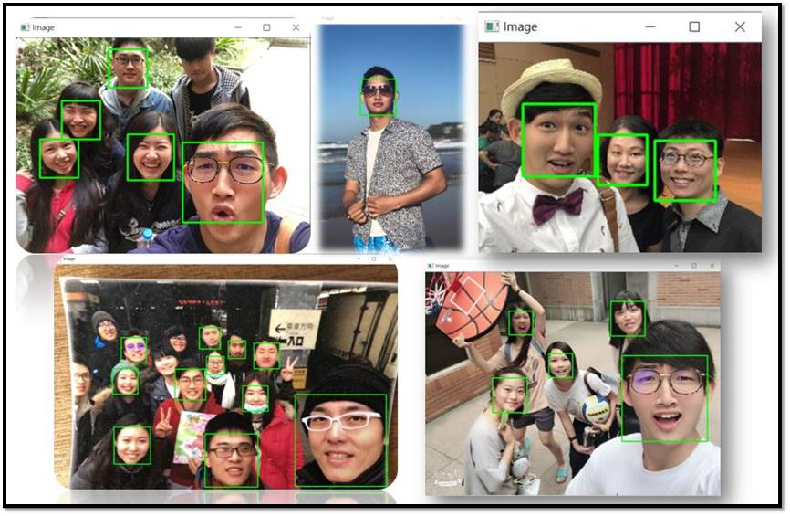

# Computer-Vision

The PyimageSearch-Optimized Project & AIA Academy CV related project

## 1.Object-Detection : 

## 2.Automatic Face-Detection : 

- Facial Detection in Multi-Person

## 3.Image-Classfication : 

- Test image-classification in 5-Object :

    - A.Face 
    - B.Guitar
    - C.Car
    - D.Motorbike
    - E.Airplane

## 4.Automatic License-Plate Recognition  :

- Test on my Car :

